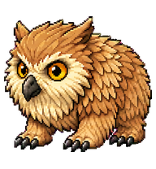
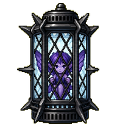
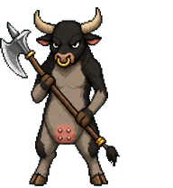

# Codex Pets

---

## Java

*A sleepy, plain, and simple cup of coffee.*


Install Java:

```sh
curl -fsSL https://raw.githubusercontent.com/CratesSo/codex-config/main/PETS/install/java.sh | bash
```

---

## Elyndex

*A sleek Culture-inspired floating drone.*


Install Elyndex:

```sh
curl -fsSL https://raw.githubusercontent.com/CratesSo/codex-config/main/PETS/install/elyndex.sh | bash
```

---

## Nukie

*A laid-back atomic bomb with a painted peace sign.*


Install Nukie:

```sh
curl -fsSL https://raw.githubusercontent.com/CratesSo/codex-config/main/PETS/install/nukie.sh | bash
```

---

## Owlbear Cub

*A curious and brave owlbear cub.*



Install Owlbear Cub:

```sh
curl -fsSL https://raw.githubusercontent.com/CratesSo/codex-config/main/PETS/install/owlbear-cub.sh | bash
```

---

## Moonlantern Pixie

*A captive pixie inside a Moonlantern. Grants protection from the Shadow Curse.*



Install Moonlantern Pixie:

```sh
curl -fsSL https://raw.githubusercontent.com/CratesSo/codex-config/main/PETS/install/dolly.sh | bash
```

---

## Cow King

*Mooo, moo moo moo. MOOO!*



Install Cow King:

```sh
curl -fsSL https://raw.githubusercontent.com/CratesSo/codex-config/main/PETS/install/cow-king.sh | bash
```

---

## Backup Behavior

*Existing pets with the same id are saved with a timestamp before the new copy is installed.*
