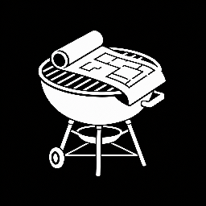

# plan-my-grill 

**Interrogates a plan or design until handoff-ready.**

## Note

- This skill uses Codex's `request_user_input` questions; it does not use Plan mode.
- Enable that capability in `~/.codex/config.toml` with `default_mode_request_user_input = true`.

## How to use

1. Ensure `default_mode_request_user_input = true` is set in `~/.codex/config.toml`.
2. Type `$plan-my-grill <your idea>`.
3. Select the planning depth.
4. Answer following questions.
5. Receive handoff-ready plan when all questions are answered.

You can answer "stop" at any time to stop early.

## When to use

- Simple, but **ambiguous** task implementation.
- Complex planning or implementation.

## Install

`npx skills@latest add https://github.com/CratesSo/codex-config/tree/main/SKILLS/plan-my-grill`

## Adapted from Matt Pocock's [`grill-me`](https://github.com/mattpocock/skills/tree/main/grill-me) skill.
